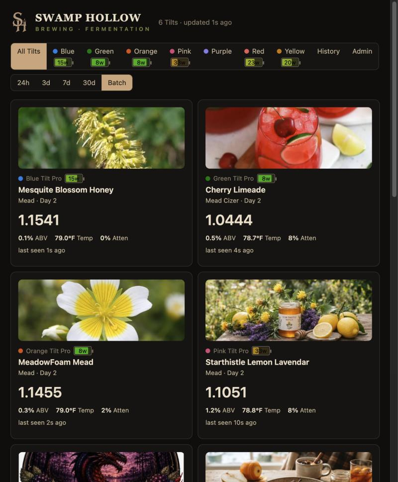
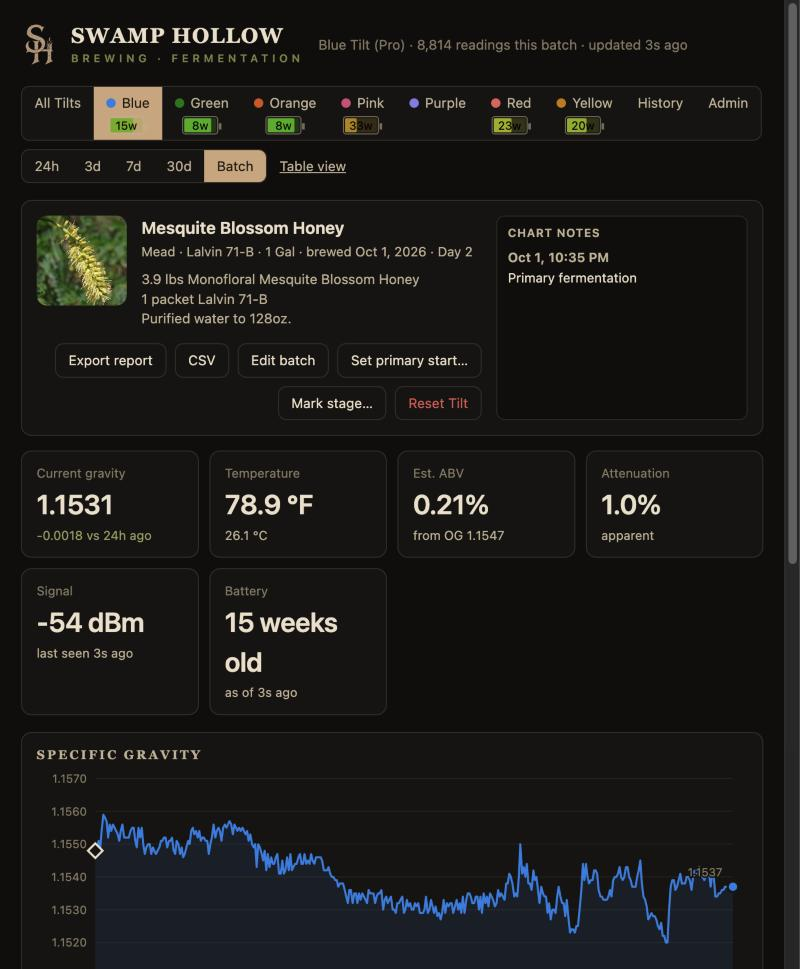
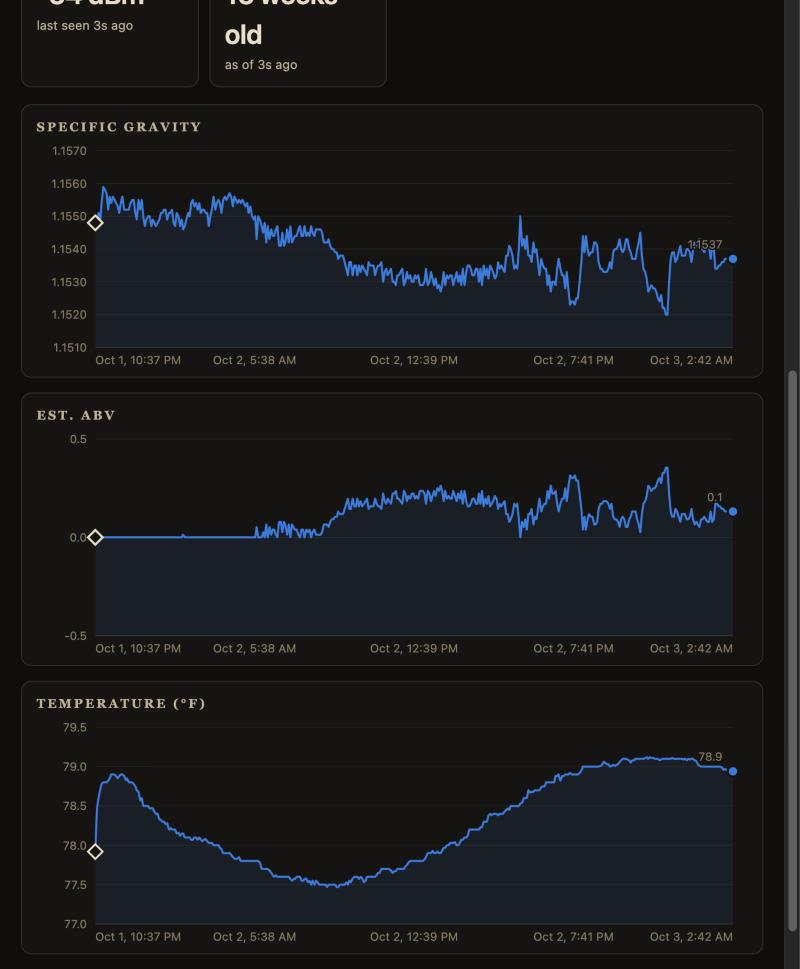
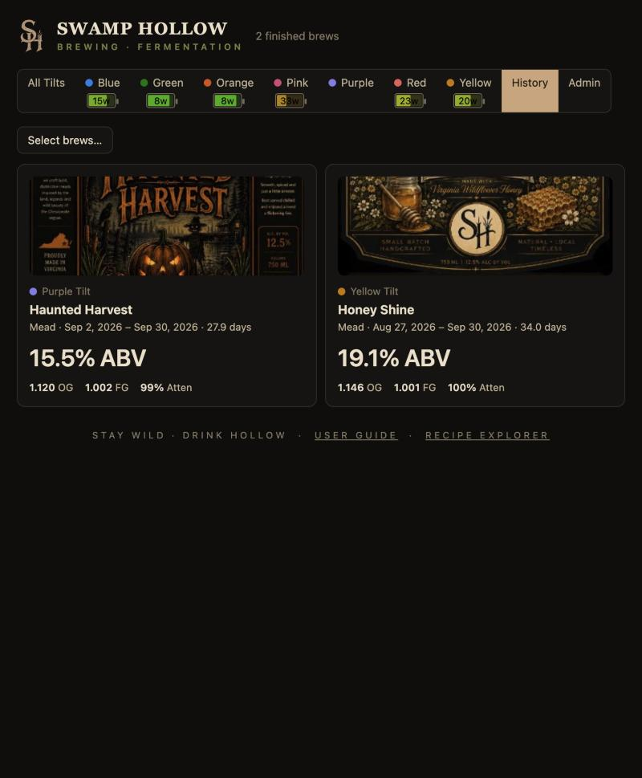
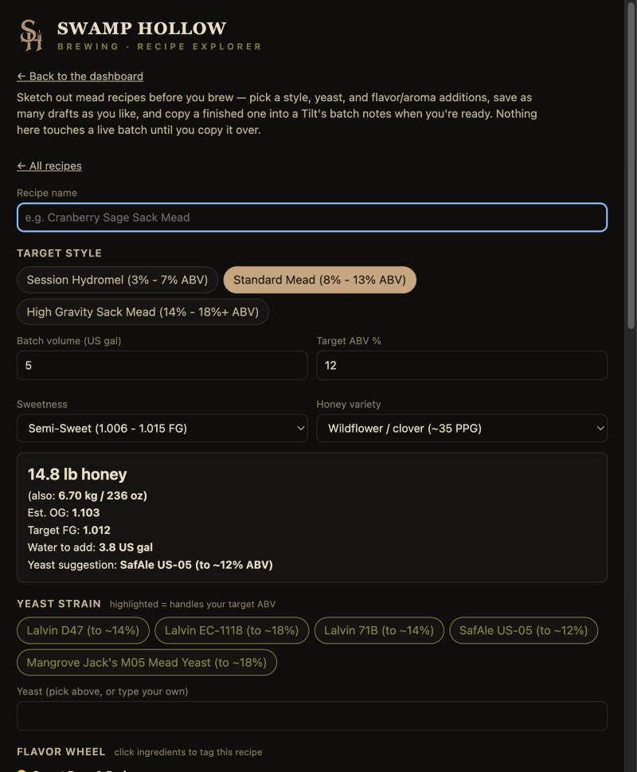
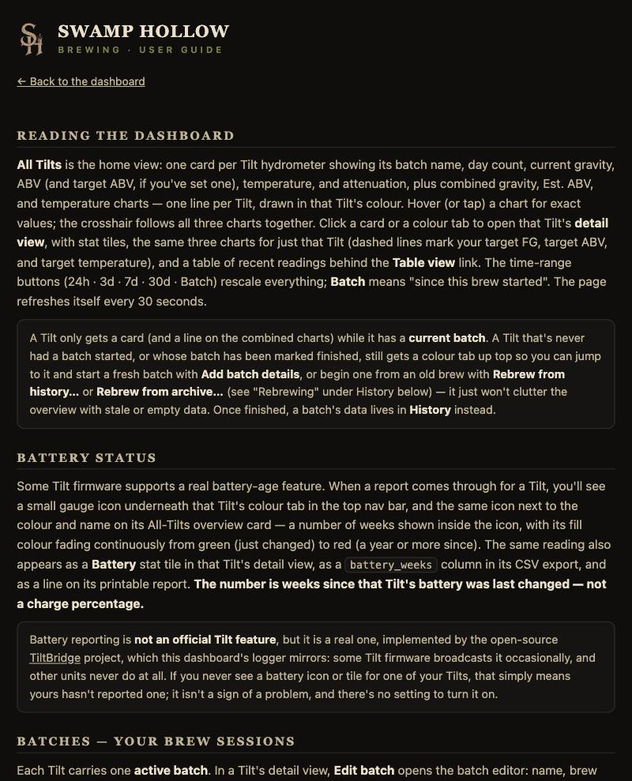

# Tilt Dashboard

A self-contained fermentation dashboard for the [Tilt Hydrometer](https://tilthydrometer.com/) (Tilt, Tilt Pro, and Tilt Mini Pro), built to run on a Raspberry Pi. Point it at as many Tilts as you have, and it logs every reading, tracks batches Brewfather-style, charts gravity/ABV/temperature live, and prints a report when the brew's done — all from one Python file, with no database, no build step, and no internet connection required.

## Features

- **Multi-Tilt dashboard** — one overview page for every Tilt currently fermenting something, with live gravity, estimated ABV, temperature, attenuation, and signal/battery status; a detail view per Tilt with synced charts and a recent-readings table.
- **Same-colour Tilts** — two (or more) Tilts of one colour are told apart by their Bluetooth address, each with its own tab, batches, history and an optional nickname.
- **Batch tracking** — name, style, brew date, yeast, target gravity/ABV/temperature, notes, and a photo per batch, with full history of every past brew once it's finished.
- **Chart annotations** — pin a permanent note to an exact moment on the chart (a dry hop, a temperature change), and mark when a batch crossed into a later fermentation stage (secondary, bulk aging, bottle conditioning, or your own custom list) — both show up as markers right on the charts.
- **Mead recipe builder** — a honey/water calculator, yeast picker, and flavor/aroma wheels for planning a mead before you brew, plus a standalone recipe explorer (`/recipes`) for sketching ideas with nothing started yet.
- **Reports, CSV, and archives** — a printable brew report (with charts and notes), raw-data CSV export, and a one-file HTML archive that embeds a finished batch's complete data so it survives log rotation or a reset.
- **Fast on a big log, with a one-click clean-up** — per-Tilt indexing keeps refreshes quick, and **Admin → Thin old data** shrinks a long-running log (with a preview, progress and a backup) without touching your batches.
- **Configurable branding** — set your own display name and tagline from the Admin page; it shows in the header, browser tab, and every report, no code changes needed.
- **Self-updating** — install new versions of the dashboard or logger straight from the Admin page, over the network, with no SSH session required after initial setup.
- **Zero dependencies for the dashboard** — `tilt_dashboard.py` uses only the Python standard library. The logger (`tilt_logger.py`) needs one package ([`bleak`](https://github.com/hbldh/bleak)) to talk to Bluetooth.

## Quick start (Raspberry Pi)

```bash
git clone <this repo's URL>
cd tilt-dashboard
sudo bash install.sh
```

Then open `http://<your-pi-address>:8080/` from any computer, phone, or tablet on your network. That's it — the installer sets up both services (the Bluetooth logger and the web dashboard), creates a dedicated service user, configures log rotation, and enables everything to start on boot.

Full walkthrough, including testing each piece by hand before trusting it to run unattended: see **[SETUP.md](SETUP.md)**. Feature-by-feature reference and the full HTTP API: see **[DASHBOARD.md](DASHBOARD.md)**. Once it's running, the dashboard also serves its own end-user guide at `/guide` — no internet needed to read it.

## Why a Raspberry Pi, and why one file?

A Pi 3B+ (or better) with Bluetooth is cheap, sips power, and can sit next to the fermenter for the life of the brew — no laptop needs to stay on. Keeping the dashboard to a single Python file with no external dependencies (standard library only) means there's nothing to `pip install`, nothing to go out of date, and nothing that breaks because a package registry is unreachable — you can `scp` one file to a Pi with no internet access at all and it just runs.

## What it looks like



A real instance mid-brew — six Tilts, each with its own batch photo, live stats, and a synced chart. The branding shown here ("Swamp Hollow") is just one example of what you can set under **Admin → Branding**; a fresh install starts out generic ("Tilt Dashboard") until you make it your own, no code changes needed.

### A single Tilt, in detail



Click into any Tilt for its own view — the batch photo and notes, live stat tiles, and, further down the page, a synced Specific Gravity / Est. ABV / Temperature chart stack with a marker for any note you've pinned:



### History



Every finished batch moves to **History** with its final stats intact — and whatever label art you dropped in along the way.

### Mead recipe builder



Pick a style and target ABV and the built-in calculator works out the honey, water, and a yeast suggestion on the spot — then tag flavor and aroma notes from the wheels below. The **Recipe Explorer** (`/recipes`) works standalone, with nothing brewing yet, for sketching ideas before you buy anything.

### Built-in user guide



Every install also serves its own end-user guide at `/guide` — no internet connection needed to read it.

## License

[MIT](LICENSE) — use it, modify it, brew with it.
